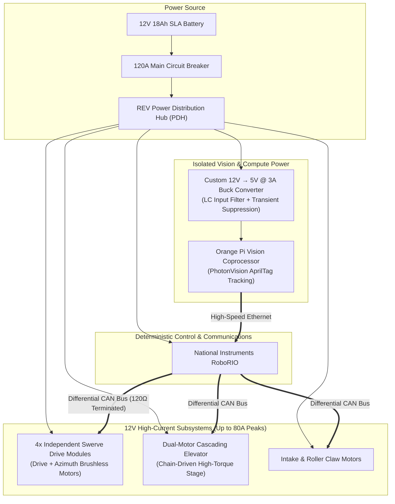

  

    
    

      FRC Team 7763 (Carrborobotics) competition robot positioned at the Coral loading station during the 2025 FIRST Robotics Competition season.
    

  

## 1. Role & Engineering Overview

As the **Lead Electrical and Harnessing Engineer** for **Carrborobotics (FIRST Robotics Competition Team 7763)** in Carrboro, NC (August 2024 – April 2025), I directed the electrical system architecture, high-current power distribution, sensor harnessing, and control electronics for our competition robot.

In addition to architecting the electrical and communication infrastructure, I contributed to the mechanical design team, utilizing advanced **CAD (Onshape)** to model and iterate critical robot mechanisms—including the cascading elevator, pivoting intake wrist, chassis packaging, and custom sensor mounts whenever needed.

---

## 2. Electrical Harnessing & High-Current 12V Power Distribution

FIRST Robotics Competition machines push power electronics to their absolute limits. With rapid reversals on 4-wheel independent swerve drive modules and high-load elevator lifts, the robot regularly demands transient peak currents approaching **80A per motor channel**.

  

    
    

      Bellypan electrical assembly and wire harnessing: Duracell 12V battery, REV Power Distribution Hub (PDH), swerve drive motor controllers, and clean wiring channels.
    

  

### Engineering Challenges & Solutions:

- **12V High-Current Battery & Bus Architecture:**
  - Designed the primary power trunk using **4 AWG ultra-flexible fine-strand copper cables** connecting the 12V 18Ah AGM Sealed Lead-Acid battery through **Anderson SB50 high-current connectors** to a **120A thermal-magnetic circuit breaker** and the central **REV Power Distribution Hub (PDH)**.
  - Implemented strict wire gauge standards across all branches: 10–12 AWG for high-draw brushless motor drive stages, 14–16 AWG for intermediate actuator mechanisms, and 18–22 AWG for logic, sensors, and communication buses.

- **Mitigating Voltage Sag & Under-Voltage Lockout (UVLO):**
  - Sudden stall currents across 8+ brushless motors during defensive pushing or rapid accelerations can drag raw battery voltage below **7.0V**, triggering an automatic RoboRIO brownout and motor controller disable.
  - To solve this, I configured tuned **software stator current limiting** and **supply current limits** within the motor controller firmware (CTRE Talon FX / REV SPARK MAX).
  - Limiting peak stator current capped excessive inductive draw during stall while maintaining maximum torque output, completely eliminating match brownouts and protecting motor windings from thermal burnout.

- **Multi-Stage Dynamic Elevator Harnessing:**
  - Routing power and sensor lines up a rapid, 2-meter multi-stage cascading elevator required continuous flex endurance without risking wire pinch, snagging, or fatigue fractures.
  - Integrated heavy-duty **energy chains (drag chains)** along the vertical mast with custom 3D-printed entry/exit strain relief brackets, ensuring all motor, encoder, and limit switch wires adhered strictly to minimum dynamic bend radii.

---

## 3. Custom Buck-Regulated Power for PhotonVision Coprocessor

Autonomous scoring and precision field alignment relied on an **Orange Pi coprocessor** running **PhotonVision** to detect 3D AprilTag fiducials (such as Tag ID 12 on the Reefscape Coral Station) at 50+ frames per second.

  

    
    

      Elevator carriage and intake mechanism assembly, showing cable chain routing, structural gusseting, and sensor harnesses.
    

  

### Problem & Failure Mode:

In prior designs, single-board computers (SBCs) powered directly from standard auxiliary ports experienced intermittent reboot loops, memory corruption, and freeze states. These failures were caused by two compounding factors:

1. **Severe Inductive Kickback & Voltage Sag:** High-power brushless motor commutations generated severe $L \cdot \frac{di}{dt}$ transient spikes coupled with transient battery dips down to 8V.
2. **Electrostatic Discharge (ESD):** Static charges accumulated on robot wheels from high-speed friction against the competition arena carpet discharged into unprotected SBC I/O and ground pins.

### The Engineering Solution:

- Installed and integrated a dedicated **custom 12V-to-5V step-down buck converter** capable of delivering **3A continuous (5A peak)** clean DC power directly to the Orange Pi.
- Engineered an **LC low-pass input filter** (shielded power inductor and low-ESR ceramic capacitor bank) immediately upstream of the buck regulator. The filter effectively attenuated high-frequency motor switching noise and clamped inductive back-EMF spikes before they could enter the regulator.
- Isolated coprocessor chassis grounding to eliminate ground loops and added TVS protection on the power input lines.
- **Result:** Zero vision coprocessor crashes, brownouts, or resets throughout all regional and championship match cycles.

---

## 4. Deterministic Differential CAN Bus Architecture

Reliable motor synchronization and closed-loop control across the robot demanded deterministic communication without packet loss.

- **Network Topology:** Built a unified **differential CAN 2.0B bus** linking the RoboRIO, REV PDH, 8 swerve motor controllers, 4 CANcoder absolute encoders, elevator motors, and intake controllers.
- **Impedance Matching & Termination:** Maintained a controlled **$120\,\Omega$ characteristic impedance** twisted pair across the entire bus topology, terminated with precision $120\,\Omega$ end-of-line resistors to prevent signal reflections and standing wave interference.
- **EMI Segregation:** Physically routed the sensitive CAN twisted pairs through dedicated low-voltage wire raceways away from the high-current motor stator phase wires, suppressing electromagnetic interference (EMI) and maintaining bus utilization with sub-10ms packet latencies.

---

## 5. Mechanical CAD & Robot Subsystem Design

Beyond electrical engineering, I was heavily involved in CAD modeling and mechanical design in **Onshape**, taking mechanisms from initial concept sketches through 3D CAD assemblies and CNC fabrication.

  

    
    

      Complete 3D Onshape CAD model of the FRC Team 7763 competition robot, featuring the swerve chassis, cascading elevator, pivoting intake wrist, and coral scoring mechanism.
    

  

### Mechanical Design Contributions:

- **Pivoting Intake & Roller Claw:**
  - Modeled custom CNC-milled **aluminum side plates** optimized with lightening pocket patterns to minimize end-effector mass while maximizing torsional rigidity.
  - Designed compliant roller shafts driven by timing belts and planetary gearboxes to reliably acquire, center, and score cylindrical game elements (tubes/coral).
- **Cascading Elevator Packaging:**
  - Designed 2x1 inch thin-wall aluminum extrusion upright masts with custom bearing blocks, constant-force spring counterbalances, and chain drive rigging.
  - Packaged diagonal reinforcement trusses to ensure lateral stiffness under high acceleration while maintaining clearance for the intake arm's full sweeping arc.
- **Electrical Bellypan & Packaging:**
  - Modeled the entire electrical component layout in CAD before fabrication to ensure optimal center-of-gravity placement, easy battery swap access, and direct airflow across motor controllers.
- **Rapid Prototyping & Fabrication:**
  - Generated DXF cut files for CNC router milling of polycarbonate and aluminum gussets.
  - 3D-printed custom camera enclosures, optical sensor brackets, and cable combs in carbon-fiber reinforced PETG and TPU.

---

## 6. Competition Execution & Pit Operations

  

    
    

      Rapid pit diagnostics, mechanical adjustments, and electrical inspection between qualification matches at competition.
    

  

During regional and championship events, fast turnaround times between matches (often under 10 minutes) require rigorous operational discipline:

- **Automated Pre-Flight Checklist:** Designed an electrical inspection checklist verifying battery internal resistance, CAN bus packet health, breaker terminal torque, and motor encoder calibrations prior to queuing.
- **Rapid Pit Diagnostics:** Performed real-time hardware diagnostics and pit repairs under tight time constraints, ensuring 100% electrical uptime and field readiness across every elimination match.

---

## 7. Technical Specifications Summary

| Subsystem                    | Engineering Specification                  | Implementation Details                                                                         |
| :--------------------------- | :----------------------------------------- | :--------------------------------------------------------------------------------------------- |
| **Team & Season**            | FRC Team 7763 (Carrborobotics)             | 2025 FIRST Robotics Competition Season (Reefscape)                                             |
| **Role**                     | Lead Electrical & Harnessing Engineer      | Electrical architecture, high-current PDN, coprocessor power, CAN bus, mechanical CAD          |
| **Primary Power Bus**        | 12V DC nominal (SLA 18Ah battery)          | 120A main breaker, 4 AWG primary leads, Anderson SB50, REV Power Distribution Hub              |
| **Peak Current Capability**  | Up to 80A peak per brushless drive channel | Managed via firmware stator current limits and supply current caps to prevent UVLO (<7.0V)     |
| **Vision Coprocessor Power** | Isolated 12V $\to$ 5V @ 3A step-down       | Custom buck converter with LC input filter, eliminating inductive spikes and ESD reboot cycles |
| **Vision Subsystem**         | PhotonVision on Orange Pi SBC              | High-FPS 3D AprilTag pose estimation and autonomous field alignment                            |
| **Communications Bus**       | Differential CAN 2.0B (1 Mbps)             | Controlled impedance twisted pair, $120\,\Omega$ end-of-line termination, sub-10ms latency     |
| **Elevator Harnessing**      | Multi-stage dynamic flex harness           | Continuous-flex energy chains (drag chains) with custom strain relief mounts                   |
| **CAD & Mechanical Design**  | Onshape 3D CAD modeling                    | Full robot assembly, swerve chassis, cascading elevator, intake wrist, CNC aluminum plates     |
| **Fabrication Methods**      | CNC router plate milling & 3D printing     | Aluminum lightening gussets, polycarbonate guards, carbon-fiber PETG/TPU brackets              |
